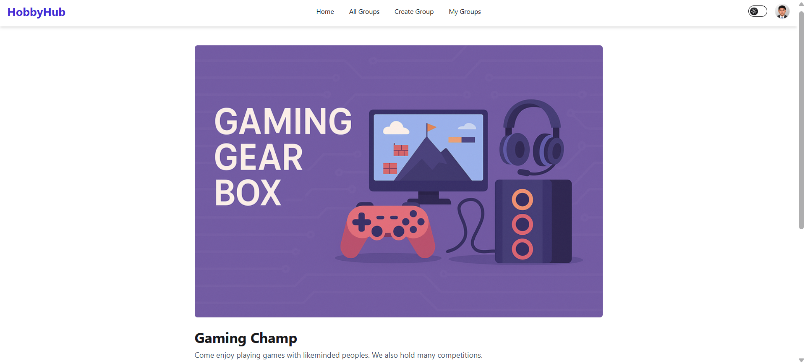

# HobbyHub – Frontend

## Overview
HobbyHub is a social platform that connects people through shared hobbies such as painting, hiking, and gaming.  
The frontend is designed for performance, responsiveness, and accessibility using modern web technologies.

## Live Demo
[HobbyHub Live Site](https://nimble-pixie-ed13e1.netlify.app/)

## Tech Stack
**Client:** React, Vite, React Router, Tailwind CSS, DaisyUI  
**Auth:** Firebase Authentication (Email/Password + OAuth)  
**Other:** React Toastify, React Simple Typewriter, Lottie React

## Features
- Modern, responsive UI with light/dark mode
- Firebase authentication with email/password & OAuth
- Create, browse, and manage hobby groups (full CRUD)
- Protected routes for user-specific actions (Create Group, My Groups)
- Mobile-friendly adaptive design with hamburger menu
- Carousel banner and animated content
- Custom 404 (Not Found) page




## Folder Structure

```
src/
  ├── pages/
  ├── components/
  ├── contexts/
  ├── layout/
  └── firebase/
```

## Setup Instructions

## Run Locally
```bash
git clone https://github.com/tsgm1257/HobbyHub-Frontend.git
cd hobbyhub-frontend
npm install
npm run dev
```

## Environment Variables
Create a `.env` file in the root with the following variables:
VITE_FIREBASE_API_KEY=your_api_key
VITE_FIREBASE_AUTH_DOMAIN=your_auth_domain
VITE_FIREBASE_PROJECT_ID=your_project_id
VITE_FIREBASE_STORAGE_BUCKET=your_storage_bucket
VITE_FIREBASE_MESSAGING_SENDER_ID=your_sender_id
VITE_FIREBASE_APP_ID=your_app_id

> Create a `.env` file with your Firebase config using `VITE_` prefix for variables.

## Author

- Developed by Tanzeem Siddique
